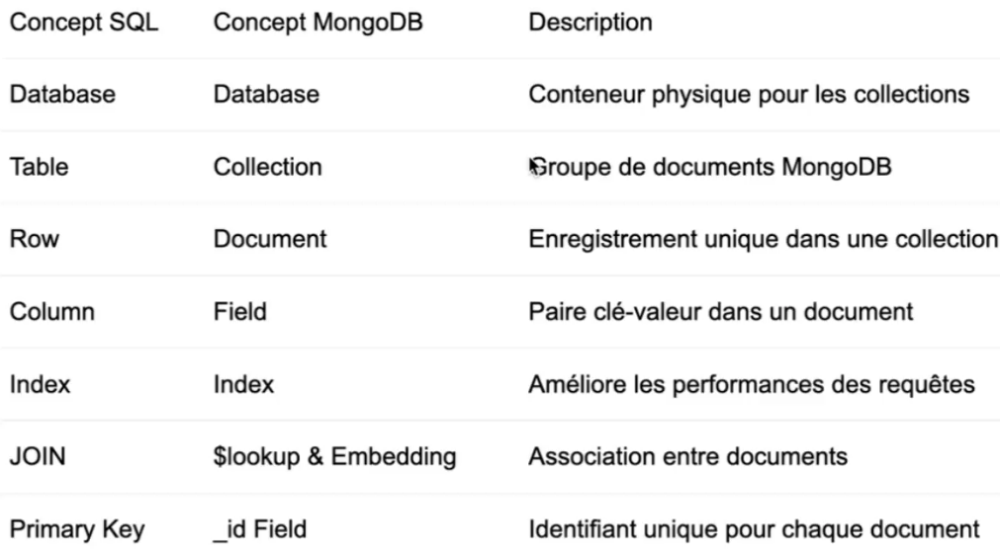

# Mongo DB 

## Qu'es ce que le NoSQL ?

NoSQL singifie "Not Only SQL" donc une famille de base de données qui s'éloigne du modèle relationnel classique 

#### Caractéristiques principales : 
- Schéma flexible ou absent 
- Conçu pour la scalabilité horizontale
- Optimisé pour des modèles de données spécifiques 
- Compromis dans la cohérence (CAP théorème)

#### Types de bases NoSQL

- Document: MongoDB, CouchDB
- Clé-valeur: Redis, DynamoDB
- Colonne: Cassandra, Hbase
- Graphe: Neo4J, OrientDB

#### Comparaison avec les bases relationnelles

**Différences fondamentales**

- Schéma: Fixe (SQL) vs Flexible (MongoDB)
- Relations: Jointures explicites vs Documents ibriqués 

### Pourquoi MongoDB ?

**Forces**

- Schéma flexible adaptatif
- Modèle de données intuitif (JSON)
- Performances élevées en lecture/écriture
- Scalabilité horizontale (sharding natif)
- Requêtes riches et expressives
- Indexation avancée
- Distribution géographique
- Support de transactions multi-documents

**Cas d'usage**

- Application web et mobiles 
- Gestion de contenus (CMS)
- E-commerce (catalogues produits)
- IoT et données en temps réel
- Big Data et analytique 
- Gestion de métadonnées
- Stockage de données de configuration 
- Caching et sessions 

### Le Format BSON 

***Exemple de document Bson***

### Optiond d'installation 

**MongoDB Atlas (Cloud)**

1 - Création d'un compte sur mongodb.com/atlas

2 - Déploiement d'un cluster gratuit (M0)

3 - Configuration du réseau (WL IP)

4 - Création d'un utilisateur pour la connexion 

### Interfaces MongoDB

**MongoDB Shell (mongosh)**

