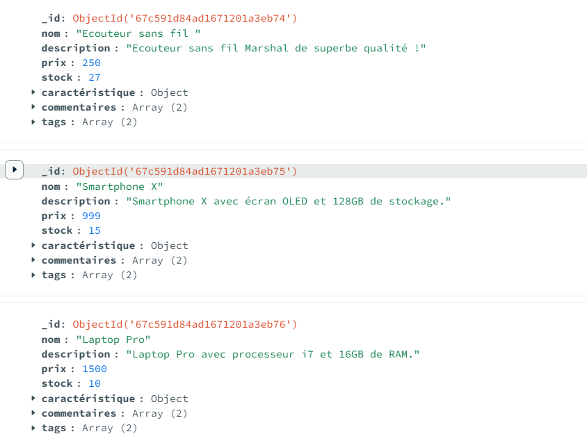
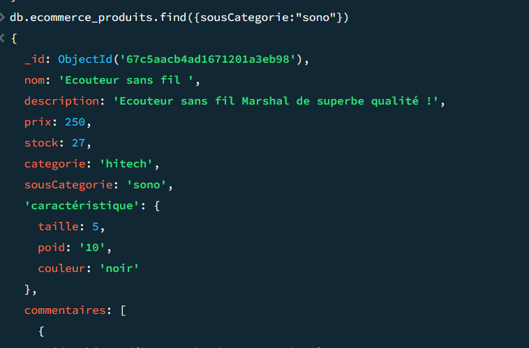
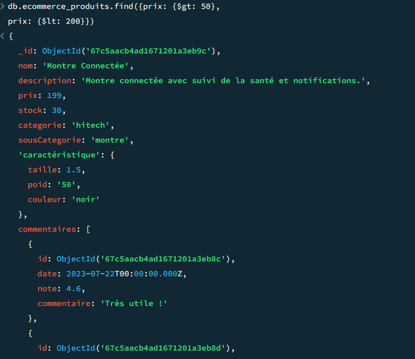

# TP2

## Requête de creation de produit  :

````sh 
db.ecommerce_produits.insertMany([
{
      nom: "Ecouteur sans fil ",
      description: "Ecouteur sans fil Marshal de superbe qualité !",
      prix: 250 ,
      stock: 27 ,
      categorie : "hitech",
      sousCategorie: "sono",
      caractéristique: {
        taille: 5,
        poid: "10",
        couleur: "noir",
      },
      
      commentaires: [
        { id: ObjectId(), date: new Date("2022-06-10"), note: 4.5, commentaire: "super produit !" },
        { id: ObjectId(), date: new Date("2022-09-18"), note: 4.3, commentaire: "bon son" }
      ],
      tags: ["premium", "sans fil"]
    },

    {
      nom: "Smartphone X",
      description: "Smartphone X avec écran OLED et 128GB de stockage.",
      prix: 999,
      stock: 15,
      categorie : "hitech",
      sousCategorie: "telephonie",
      caractéristique: {
        taille: 6.1,
        poid: "174",
        couleur: "argent",
      },
      commentaires: [
        { id: ObjectId(), date: new Date("2023-01-15"), note: 4.8, commentaire: "Excellent téléphone !" },
        { id: ObjectId(), date: new Date("2023-02-20"), note: 4.6, commentaire: "Très satisfait" }
      ],
      tags: ["smartphone", "OLED"]
    },
{
      nom: "Laptop Pro",
      description: "Laptop Pro avec processeur i7 et 16GB de RAM.",
      prix: 1500,
      stock: 10,
      categorie : "hitech",
      sousCategorie: "Ordinateur",
      caractéristique: {
        taille: 15.6,
        poid: "2000",
        couleur: "gris",
      },
      commentaires: [
        { id: ObjectId(), date: new Date("2023-03-10"), note: 4.7, commentaire: "Très performant !" },
        { id: ObjectId(), date: new Date("2023-04-05"), note: 4.5, commentaire: "Bon rapport qualité/prix" }
      ],
      tags: ["laptop", "i7"]
    },
{
      nom: "Tablette Z",
      description: "Tablette Z avec écran 10 pouces et 64GB de stockage.",
      prix: 450,
      stock: 20,
      categorie : "hitech",
      sousCategorie: "telephonie",
      caractéristique: {
        taille: 10,
        poid: "500",
        couleur: "blanc",
      },
      commentaires: [
        { id: ObjectId(), date: new Date("2023-05-12"), note: 4.4, commentaire: "Très pratique !" },
        { id: ObjectId(), date: new Date("2023-06-18"), note: 4.2, commentaire: "Bon produit" }
      ],
      tags: ["tablette", "10 pouces"]
    },
{
      nom: "Montre Connectée",
      description: "Montre connectée avec suivi de la santé et notifications.",
      prix: 199,
      stock: 30,
      categorie : "hitech",
      sousCategorie: "montre",
      caractéristique: {
        taille: 1.5,
        poid: "50",
        couleur: "noir",
      },
      commentaires: [
        { id: ObjectId(), date: new Date("2023-07-22"), note: 4.6, commentaire: "Très utile !" },
        { id: ObjectId(), date: new Date("2023-08-30"), note: 4.4, commentaire: "Fonctionne bien" }
      ],
      tags: ["montre", "connectée"]
    },
{
      nom: "Casque VR",
      description: "Casque VR avec résolution 4K et suivi des mouvements.",
      prix: 600,
      stock: 12,
      categorie : "hitech",
      sousCategorie: "JV",
      caractéristique: {
        taille: 7,
        poid: "600",
        couleur: "noir",
      },
      commentaires: [
        { id: ObjectId(), date: new Date("2023-09-15"), note: 4.9, commentaire: "Immersion totale !" },
        { id: ObjectId(), date: new Date("2023-10-10"), note: 4.7, commentaire: "Expérience incroyable" }
      ],
      tags: ["VR", "4K"]
    },
{
      nom: "Caméra 4K",
      description: "Caméra 4K avec stabilisation d'image et zoom optique.",
      prix: 800,
      stock: 8,
      categorie : "hitech",
      sousCategorie: "Image",
      caractéristique: {
        taille: 4,
        poid: "400",
        couleur: "noir",
      },
      commentaires: [
        { id: ObjectId(), date: new Date("2023-11-05"), note: 4.8, commentaire: "Qualité d'image exceptionnelle !" },
        { id: ObjectId(), date: new Date("2023-12-01"), note: 4.6, commentaire: "Très bonne caméra" }
      ],
      tags: ["caméra", "4K"]
    },
{
      nom: "Enceinte Bluetooth",
      description: "Enceinte Bluetooth avec son stéréo et autonomie de 12h.",
      prix: 150,
      stock: 25,
      categorie : "hitech",
      sousCategorie: "sono",
      caractéristique: {
        taille: 8,
        poid: "300",
        couleur: "bleu",
      },
      commentaires: [
        { id: ObjectId(), date: new Date("2024-01-10"), note: 4.5, commentaire: "Son de qualité !" },
        { id: ObjectId(), date: new Date("2024-02-14"), note: 4.3, commentaire: "Très pratique" }
      ],
      tags: ["enceinte", "Bluetooth"]
    },
{
      nom: "Drone Pro",
      description: "Drone Pro avec caméra 1080p et autonomie de 30 minutes.",
      prix: 1200,
      stock: 5,
      categorie : "hitech",
      sousCategorie: "Drone",
      caractéristique: {
        taille: 12,
        poid: "1500",
        couleur: "noir",
      },
      commentaires: [
        { id: ObjectId(), date: new Date("2024-03-20"), note: 4.7, commentaire: "Très stable en vol !" },
        { id: ObjectId(), date: new Date("2024-04-25"), note: 4.5, commentaire: "Bonne qualité vidéo" }
      ],
      tags: ["drone", "1080p"]
    },
{
      nom: "Projecteur HD",
      description: "Projecteur HD avec 3000 lumens et connectivité HDMI.",
      prix: 700,
      stock: 7,
      categorie : "hitech",
      sousCategorie: "Image",
      caractéristique: {
        taille: 10,
        poid: "2500",
        couleur: "blanc",
      },
      commentaires: [
        { id: ObjectId(), date: new Date("2024-05-15"), note: 4.6, commentaire: "Image claire et nette !" },
        { id: ObjectId(), date: new Date("2024-06-20"), note: 4.4, commentaire: "Facile à installer" }
      ],
      tags: ["projecteur", "HD"]
    },]) 
    
````

### Resultat:




## Exercice 2 :

### 1



### 2


### 3
````sh
db.ecommerce_produits.find({stock: {$gt: 0}})
````

### 4 

````sh
db.ecommerce_produits.find({ $expr: { $gte: [{ $size: "$commentaires" }, 3] } })
````

## Exercice 3 :
### 1
````sh
db.ecommerce_produits.updateMany(
  { categorie: "hitech" },
  { $mul: { prix: 1.05 } }
)
````
### 2 

on ajoute un champ promotion a tous les produit de + de 500€
````sh
db.ecommerce_produits.updateMany(
  { prix: { $gt: 500 } },
  { $set: { promotion: true } }
)
````
### 3
on ajoute un tag a tous les produits de la sous categorie sono

````sh
db.ecommerce_produits.updateMany(
  { sousCategorie: "sono" },
  { $addToSet: { tags: "nouveau" } }
)
````

### 4 

````sh
db.ecommerce_produits.updateOne(
  { nom: "Nom du produit" },
  { $inc: { stock: -1 } }
)
````

## Exercice 4 

### 1 

````sh
db.ecommerce_produits.find({
  stock: { $gt: 0 },
  tags: { $all: ["premium", "sans fil"] }
})
````

### 2 

````sh
db.ecommerce_produits.find({
  stock: { $lt: 5 },
  tags: "premium"
})
````

### 3 
````sh 
db.ecommerce_produits.find({
  commentaires: {
    $elemMatch: { note: 5 }
  }
})
````

````sh 
db.ecommerce_produits.find({ categorie: "hitech" })
  .sort({ prix: -1 })
  .limit(5)
````


