# Partie 1 Configuration et création de la base de données

Je vais utiliser mon propre jeu de donné pour éviter un téléchargement de plusieurs giga.

### Créer les livres 

````sh
db.livres.insertMany([
{
  titre: "Le Petit Prince",
  auteur: "Antoine de Saint-Exupéry",
  annee_publication: 1943,
  editeur: "Gallimard",
  genre: ["Conte", "Philosophie"],
  nombre_pages: 96,
  langue: "Français",
  disponible: true,
  stock: 3,
  note_moyenne: 4.8,
  description: "Un pilote d'avion, qui s'est écrasé dans le désert du Sahara, rencontre un jeune prince venu d'une autre planète...",
  prix: 7.50,
  isbn: "9782070612758",
  date_ajout: new Date("2023-01-15")
},
{
  titre: "1984",
  auteur: "George Orwell",
  annee_publication: 1949,
  editeur: "Secker & Warburg",
  genre: ["Dystopie", "Science-fiction"],
  nombre_pages: 328,
  langue: "Anglais",
  disponible: true,
  stock: 5,
  note_moyenne: 4.7,
  description: "Un roman dystopique qui décrit une société totalitaire sous la surveillance constante du Big Brother.",
  prix: 9.99,
  isbn: "9780451524935",
  date_ajout: new Date("2023-02-10")
},
{
  titre: "Harry Potter à l'école des sorciers",
  auteur: "J.K. Rowling",
  annee_publication: 1997,
  editeur: "Bloomsbury",
  genre: ["Fantasy", "Aventure"],
  nombre_pages: 223,
  langue: "Français",
  disponible: true,
  stock: 10,
  note_moyenne: 4.9,
  description: "Le premier livre de la série Harry Potter, où Harry découvre qu'il est un sorcier et commence son éducation magique.",
  prix: 12.50,
  isbn: "9780747532699",
  date_ajout: new Date("2023-03-05")
},
{
  titre: "Le Seigneur des Anneaux: La Communauté de l'Anneau",
  auteur: "J.R.R. Tolkien",
  annee_publication: 1954,
  editeur: "Allen & Unwin",
  genre: ["Fantasy", "Aventure"],
  nombre_pages: 423,
  langue: "Français",
  disponible: true,
  stock: 7,
  note_moyenne: 4.8,
  description: "Le premier volume de la trilogie Le Seigneur des Anneaux, où Frodon commence son voyage pour détruire l'Anneau Unique.",
  prix: 15.00,
  isbn: "9780261103573",
  date_ajout: new Date("2023-04-12")
},
{
  titre: "Pride and Prejudice",
  auteur: "Jane Austen",
  annee_publication: 1813,
  editeur: "T. Egerton",
  genre: ["Romance", "Classique"],
  nombre_pages: 279,
  langue: "Anglais",
  disponible: true,
  stock: 8,
  note_moyenne: 4.6,
  description: "Un roman classique qui explore les thèmes de l'amour et de la société à travers l'histoire d'Elizabeth Bennet et Mr. Darcy.",
  prix: 8.99,
  isbn: "9780141439518",
  date_ajout: new Date("2023-05-20")
},
{
  titre: "To Kill a Mockingbird",
  auteur: "Harper Lee",
  annee_publication: 1960,
  editeur: "J.B. Lippincott & Co.",
  genre: ["Classique", "Drame"],
  nombre_pages: 281,
  langue: "Anglais",
  disponible: true,
  stock: 6,
  note_moyenne: 4.9,
  description: "Un roman qui aborde les thèmes de la justice et des préjugés raciaux à travers les yeux de Scout Finch, une jeune fille dans le Sud des États-Unis.",
  prix: 10.99,
  isbn: "9780061120084",
  date_ajout: new Date("2023-06-15")
}
]);
````

### Créer utilisateurs :

````sh
db.utilisateurs.insertMany([
{
  nom: "Dupont",
  prenom: "Marie",
  email: "marie.dupont@example.com",
  age: 28,
  adresse: {
    rue: "123 Avenue des Livres",
    ville: "Lyon",
    code_postal: "69002"
  },
  date_inscription: new Date("2022-12-10"),
  livres_empruntes: [
    {
      livre_id: ObjectId(),
      titre: "Le Petit Prince",
      date_emprunt: new Date("2023-02-15"),
      date_retour_prevue: new Date("2023-03-15")
    }
  ],
  tags: ["fiction", "histoire"]
},
{
  nom: "Martin",
  prenom: "Jean",
  email: "jean.martin@example.com",
  age: 35,
  adresse: {
    rue: "456 Rue des Écrivains",
    ville: "Paris",
    code_postal: "75001"
  },
  date_inscription: new Date("2023-01-20"),
  livres_empruntes: [
    {
      livre_id: ObjectId(), 
      titre: "1984",
      date_emprunt: new Date("2023-03-01"),
      date_retour_prevue: new Date("2023-03-31")
    }
  ],
  tags: ["dystopie", "science-fiction"]
},
{
  nom: "Lefevre",
  prenom: "Sophie",
  email: "sophie.lefevre@example.com",
  age: 42,
  adresse: {
    rue: "789 Boulevard des Lecteurs",
    ville: "Marseille",
    code_postal: "13001"
  },
  date_inscription: new Date("2023-02-15"),
  livres_empruntes: [
    {
      livre_id: ObjectId(),
      titre: "Harry Potter à l'école des sorciers",
      date_emprunt: new Date("2023-04-10"),
      date_retour_prevue: new Date("2023-05-10")
    }
  ],
  tags: ["fantasy", "aventure"]
},
{
  nom: "Bernard",
  prenom: "Luc",
  email: "luc.bernard@example.com",
  age: 29,
  adresse: {
    rue: "321 Allée des Romans",
    ville: "Toulouse",
    code_postal: "31000"
  },
  date_inscription: new Date("2023-03-05"),
  livres_empruntes: [
    {
      livre_id: ObjectId(), 
      titre: "Le Seigneur des Anneaux: La Communauté de l'Anneau",
      date_emprunt: new Date("2023-05-01"),
      date_retour_prevue: new Date("2023-06-01")
    }
  ],
  tags: ["fantasy", "classique"]
}
  ]);
````

## Partie 2 : Requêtes de lecture (Read)

### 1 
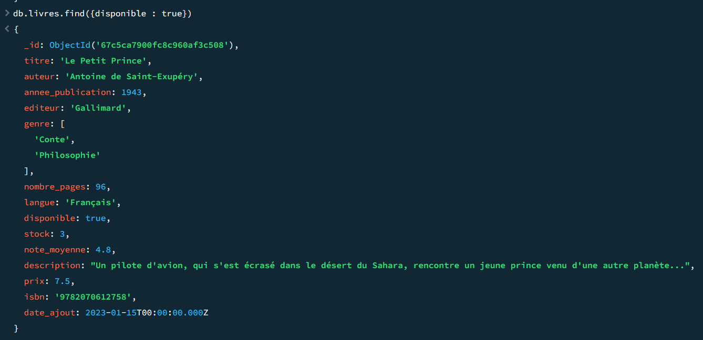

### 2

````sh
db.livres.find({annee_publication: {$gt: 2000}})
````

### 3 
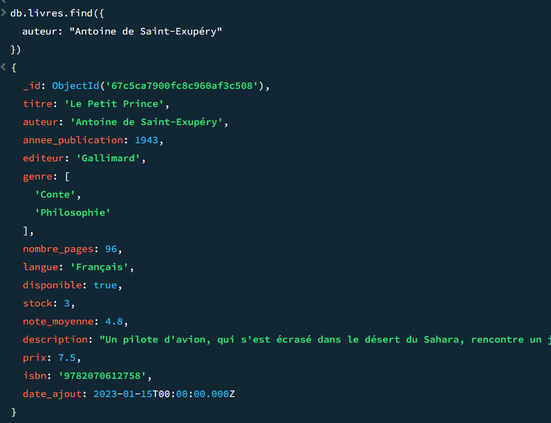

### 4 
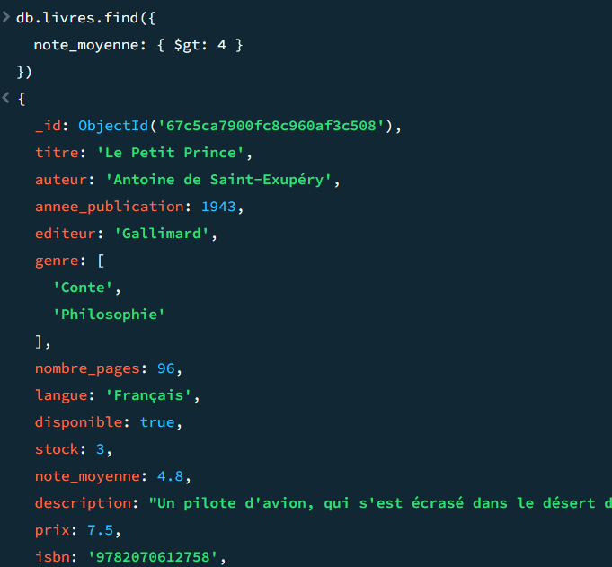

### 5 

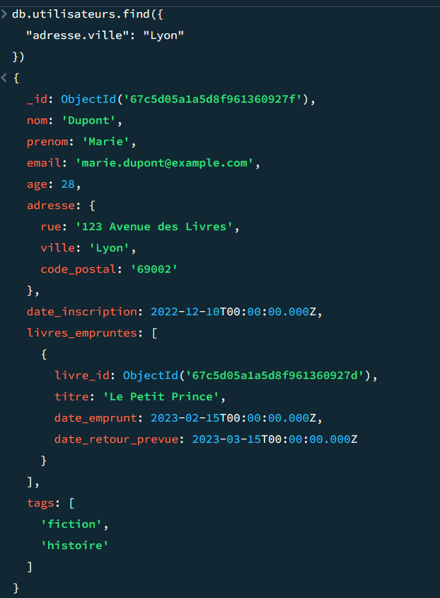

### 6

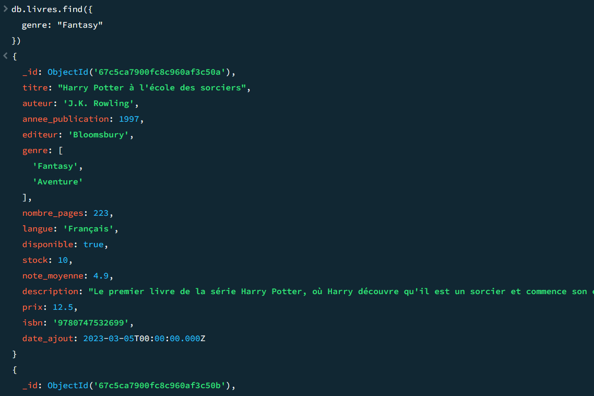

### 7 

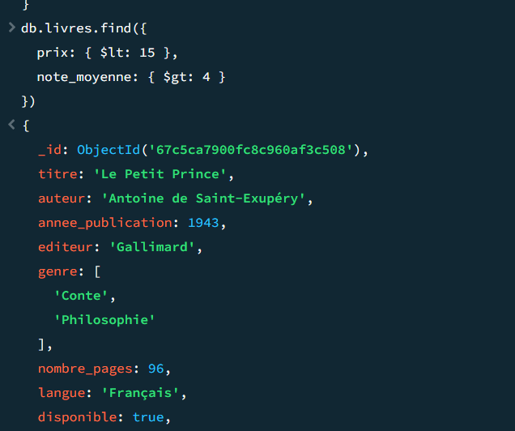

### 8 

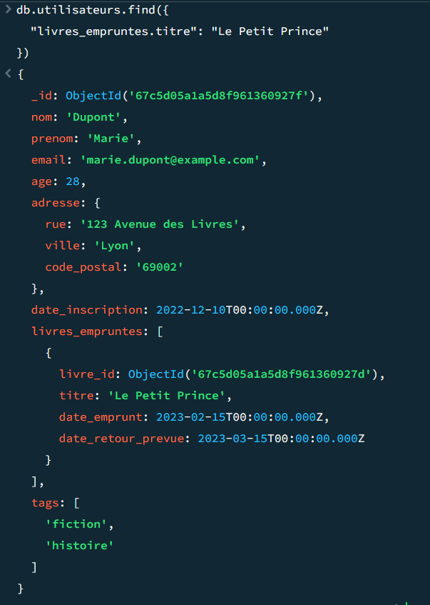

## Partie 3 : Mise à jour de documents (update)

### 1 
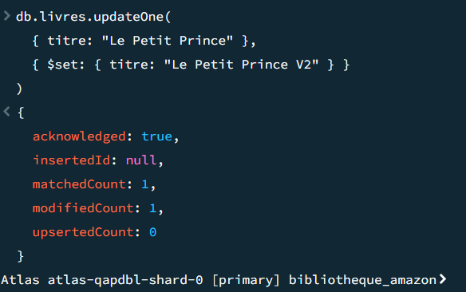

### 2 

````sh
db.livres.updateMany(
  {},
  {
    $set: { stock: 10 }
  }
)
````

### 3 

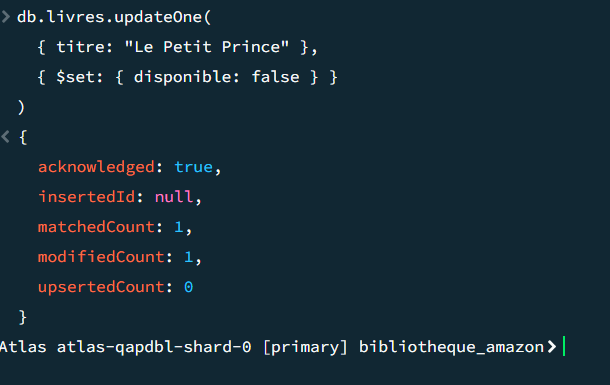

### 4 

````sh
db.utilisateurs.updateOne(
  { email: "marie.dupont@example.com" },
  { 
    $push: { 
      livres_empruntes: {
        livre_id: ObjectId('67c5ca7900fc8c960af3c509'), 
        titre: "1984",
        date_emprunt: new Date("2025-03-05"),
        date_retour_prevue: new Date("2025-04-05")
      }
    }
  }
)
````
résultat dans la table utilisateur 

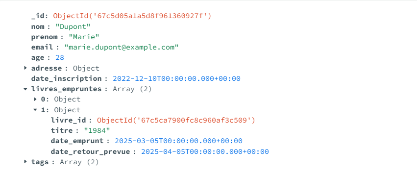

### 5 

Requête :

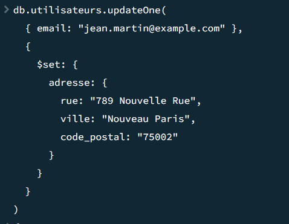

Resultat: 

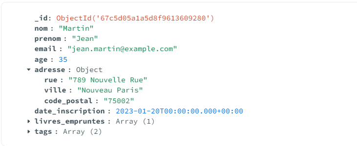

### 6 

````sh 
db.utilisateurs.updateOne(
  { email: "sophie.lefevre@example.com" }, 
  { 
    $addToSet: { tags: "nouveau_tag" } 
  }
)
````

### 7 

````sh
db.livres.updateOne(
  { titre: "Harry Potter à l'école des sorciers" }, 
  { 
    $set: { note_moyenne: 4.95 } 
  }
)
````

## Partie 5 : Requêtes avancées et projection

### 1 

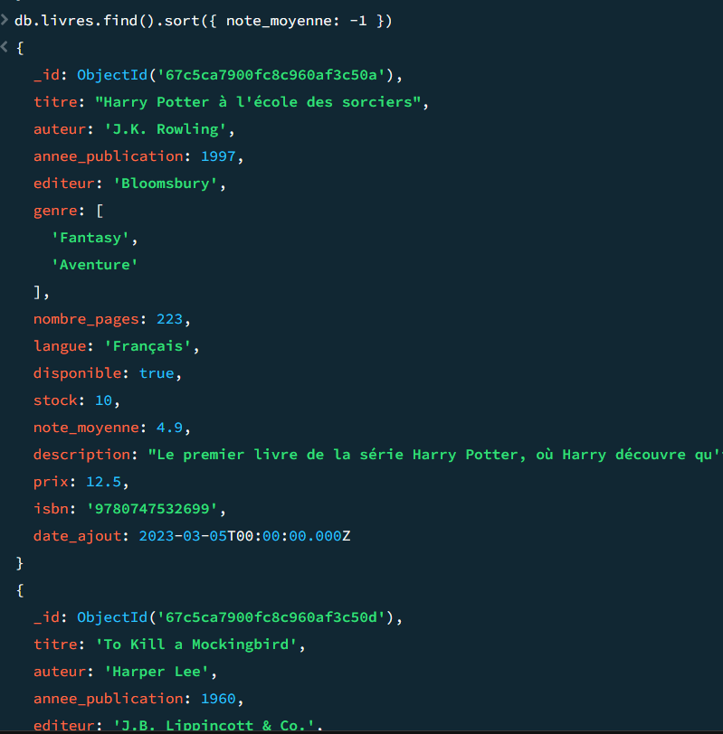

### 2 

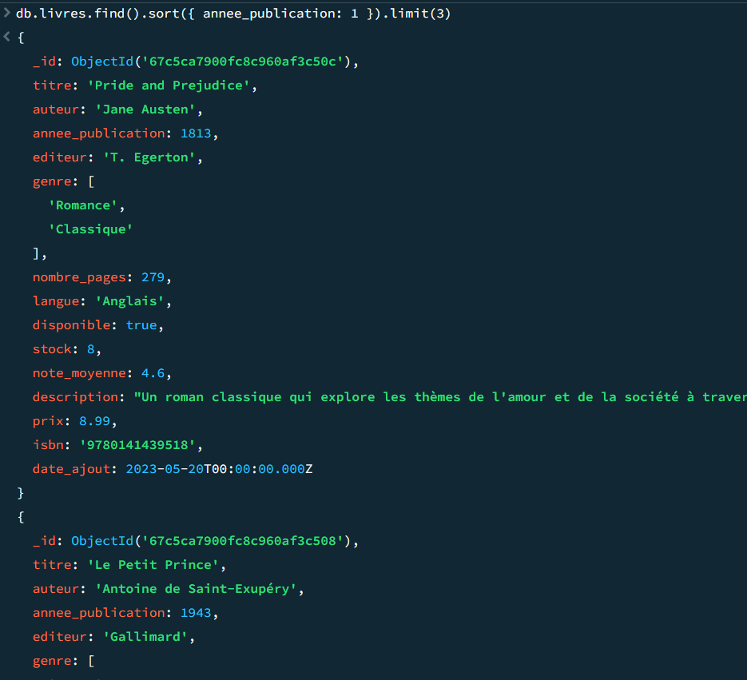

### 3 

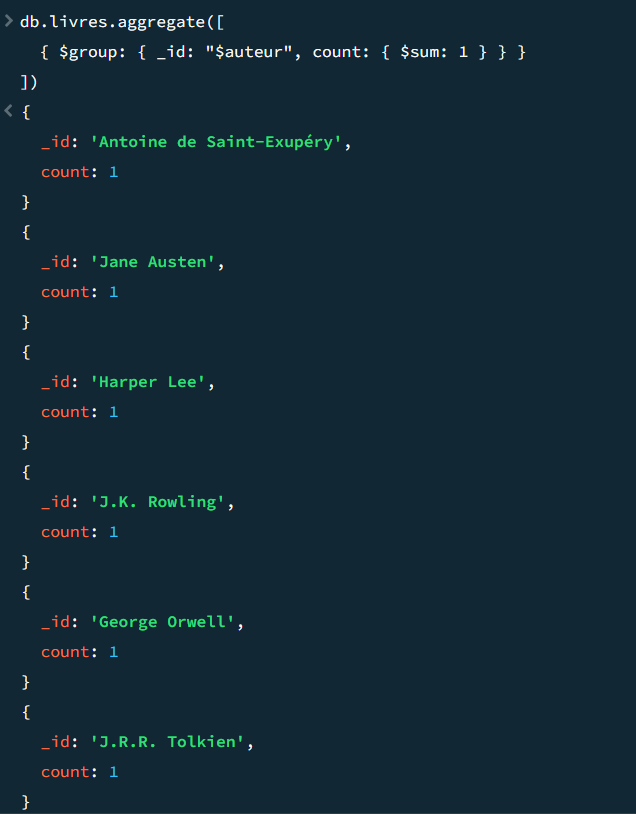

### 4 


### 5 


### 6 

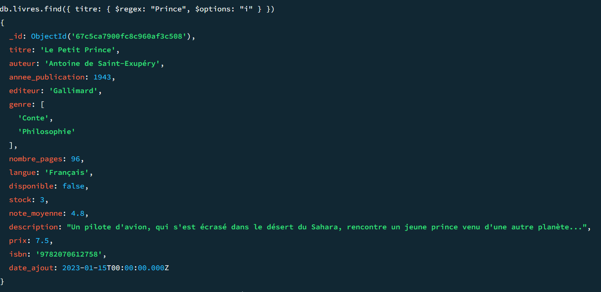


### 7 

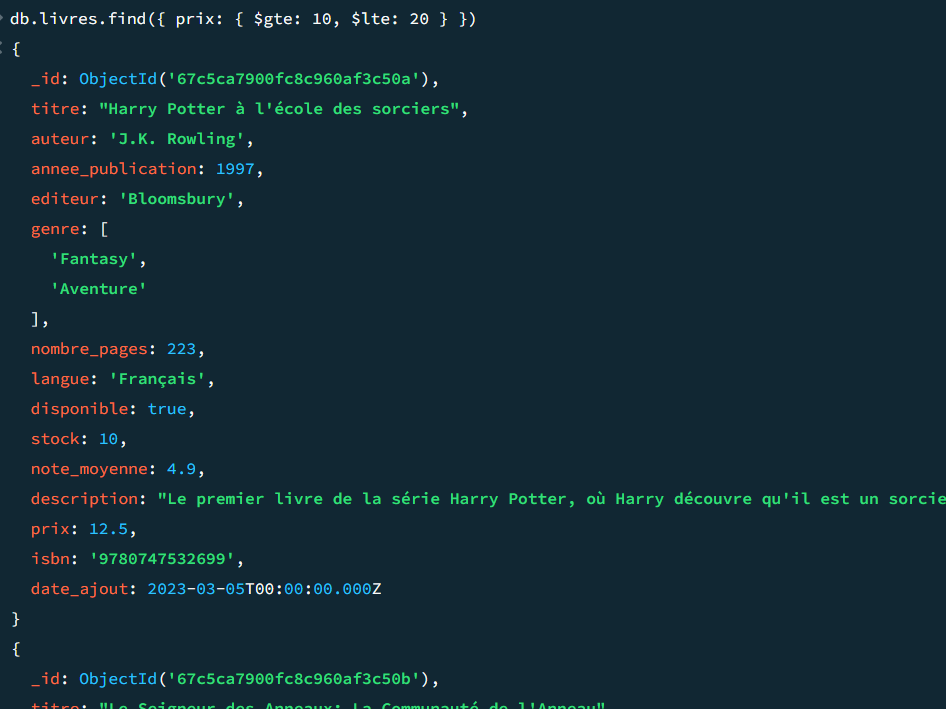

## Partie 6 : Modélisation de données 

### 1 & 2 

J'ai créer la collection avec ces emprunts comme ceci :

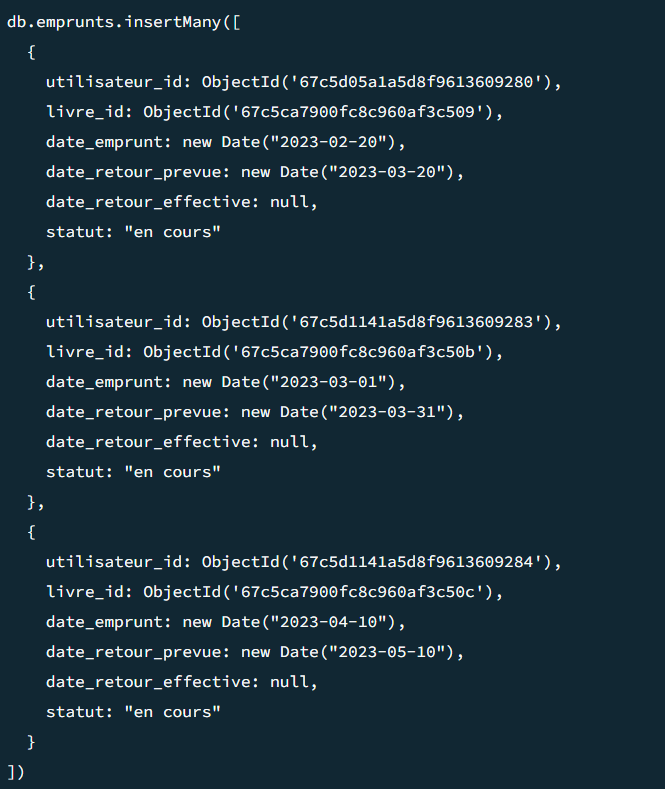

### Reflexion sur la modélisation

### 1 

La méthode ou les emprunts sont stockés avec les données utilisateurs est plus simple voici ces avantages :

- Accès rapide aux emprunts lors de la consultation des données utilisateurs
- Simplicité de mise en place

Mais elle comporte les incovéniants suivants : 

- Taille des documents par utilisateurs plus lourdes
- Obligation de passer par le documents utilisateurs pour modifier un emprunt

La méthode avec une table emprunt est plus complexe mais comporte les avantages suivant :

- Document utilisateur plus petit 
- modularités des emprunts sans toucher aux utilisateurs

Voici ces inconvéniants: 
- Il faut mettre en place des jointures entre l'utilisateurs, le livre emprunté et l'emprunt 

### 2 

Pour une application réelle je privilégierais la méthodes avec une table emprunt a part car elle permet une meilleur getion des données et de moins se perdre ou d'éviter les requêtes trop lourdes 

### 3 

Il faudrait un id pour chacun des exemplaires (examplaire_id)


