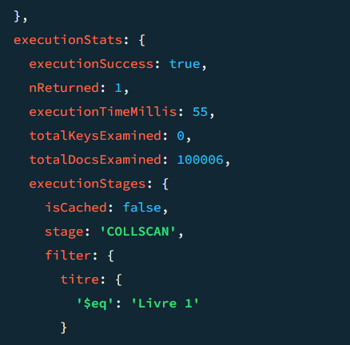
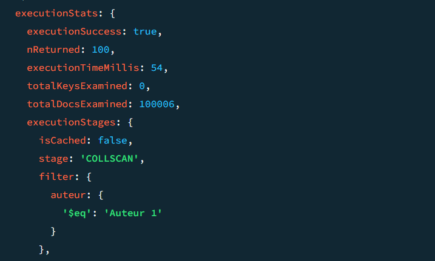
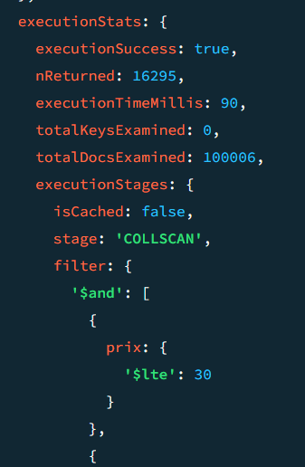
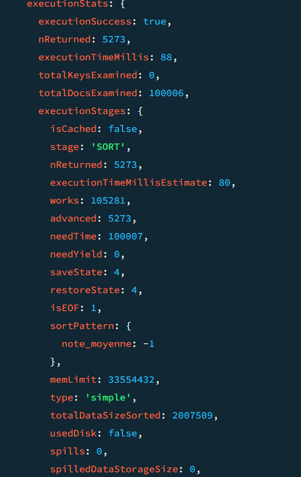

# TP Jour 2 
Etant absent le mardi et le mercredi matin je ne pourrais surement pas tout rendre

## TP 1 : Indexation et optimisation des performances 

### Exercice 1.1

Générer une liste de 100 000 livres:

Voici le script pour sortir une liste de 100 000 livres :

````sh
// À exécuter dans mongosh connecté à votre base de données
// Génération de livres
const genres = ["Fiction", "Science-fiction", "Philosophie", "Histoire", "Fantasy", "Aventure", "Romance", "Classique", "Drame"];
const langues = ["Français", "Anglais", "Espagnol", "Allemand"];
const editeurs = ["Gallimard", "Hachette", "Flammarion", "Actes Sud", "Secker & Warburg", "Bloomsbury", "Allen & Unwin", "T. Egerton", "J.B. Lippincott & Co."];

function getRandomElement(arr) {
  return arr[Math.floor(Math.random() * arr.length)];
}

function getRandomInt(min, max) {
  return Math.floor(Math.random() * (max - min + 1)) + min;
}

const livres = [];
for (let i = 0; i < 100000; i++) {
  const livre = {
    titre: `Livre ${i + 1}`,
    auteur: `Auteur ${getRandomInt(1, 1000)}`,
    annee_publication: getRandomInt(1900, 2025),
    editeur: getRandomElement(editeurs),
    genre: [getRandomElement(genres), getRandomElement(genres)],
    nombre_pages: getRandomInt(100, 1000),
    langue: getRandomElement(langues),
    disponible: Math.random() < 0.5,
    stock: getRandomInt(1, 20),
    note_moyenne: parseFloat((Math.random() * 5).toFixed(1)),
    description: `Description du livre ${i + 1}`,
    prix: parseFloat((Math.random() * 50).toFixed(2)),
    isbn: `978-${getRandomInt(1000000000, 9999999999)}`,
    date_ajout: new Date()
  };
  livres.push(livre);
}

db.livres.insertMany(livres);
````

#### 2 Annalyse des performances 


**Recherche par titre**
````sh 
db.livres.find({ titre: "Livre 1" }).explain("executionStats")
````


totalDocxExamined: 100 006
executionTimeMillis: 55 
type: COLLSCAN

**Recherche par auteur**
````sh 
db.livres.find({ auteur: "Auteur 1" }).explain("executionStats")
````


totalDocxExamined: 100 006
executionTimeMillis: 54 
type: COLLSCAN

**Recherche par plage de prix (ici entre 10€ et 30€) et note minimale (de 3 ici)**

````sh 
db.livres.find({ prix: { $gte: 10, $lte: 30 }, note_moyenne: { $gte: 3 } }).explain("executionStats")
````


totalDocxExamined: 100 006
executionTimeMillis: 90 
type: COLLSCAN

**Recherche filtrée par genre et langue avec tri par note décroissant**

````sh
db.livres.find({ genre: "Fiction", langue: "Français" }).sort({ note_moyenne: -1 }).explain("executionStats")
````


totalDocxExamined: 100 006
executionTimeMillis: 88 
type: SORT

#### 3 Tableau des performances

| Type de recherche                                      | Nombre de documents examinés (totalDocsExamined) | Temps d'exécution (executionTimeMillis) | Type d'étape utilisée (stage) |
|--------------------------------------------------------|--------------------------------------------------|-----------------------------------------|--------------------------------|
| Recherche par titre exact                              | 100 006                                          | 55                                      | COLLSCAN                       |
| Recherche par auteur                                   | 100 006                                          | 54                                      | COLLSCAN                       |
| Recherche par plage de prix et note minimale           | 100 006                                          | 90                                      | COLLSCAN                       |
| Recherche filtrée par genre et langue avec tri par note décroissante | 100 006                                          | 88                                      | SORT                           |

### Exercice 1.2

#### 1 Création d'index

- Index simple pour le champ titre : 
````sh 
db.livres.createIndex({ titre: 1 })
````

- Index simple pour le champ auteur

````sh 
db.livres.createIndex({auteur: 1})
````

- Index composite pour les champs prix et notes_moyenne

````sh 
db.livres.createIndex({ prix: 1, note_moyenne: 1})
````

- Index composite sur les champs genre, langue et note_moyenne 

````sh 
db.livres.createIndex({ genre: 1, langue: 1, note_moyenne: -1})
````

#### 2 Comparaison des resultats 


**Recherche par titre**
````sh 
db.livres.find({ titre: "Livre 1" }).explain("executionStats")
````

totalDocxExamined: 1
executionTimeMillis: 1
type: Fetch

**Recherche par auteur**
````sh 
db.livres.find({ auteur: "Auteur 1" }).explain("executionStats")
````

totalDocxExamined: 100
executionTimeMillis: 1 
type: Fetch

**Recherche par plage de prix (ici entre 10€ et 30€) et note minimale (de 3 ici)**

````sh 
db.livres.find({ prix: { $gte: 10, $lte: 30 }, note_moyenne: { $gte: 3 } }).explain("executionStats")
````

totalDocxExamined: 16295
executionTimeMillis: 47 
type: Fetch

**Recherche filtrée par genre et langue avec tri par note décroissant**

````sh
db.livres.find({ genre: "Fiction", langue: "Français" }).sort({ note_moyenne: -1 }).explain("executionStats")
````


totalDocxExamined: 5273
executionTimeMillis: 14 
type: Fetch

**Tableau comparatif**

| Type de recherche                                      | Nombre de documents examinés (totalDocsExamined) | Temps d'exécution (executionTimeMillis) | Type d'étape utilisée (stage) | Avec index : Nombre de documents examinés (totalDocsExamined) | Avec index : Temps d'exécution (executionTimeMillis) | Avec index : Type d'étape utilisée (stage) |
|--------------------------------------------------------|--------------------------------------------------|-----------------------------------------|--------------------------------|--------------------------------------------------------------|------------------------------------------------------|------------------------------------------------------|
| Recherche par titre exact                              | 100 006                                          | 55                                      | COLLSCAN                       | 1                                                            | 1                                                    | Fetch                                                |
| Recherche par auteur                                   | 100 006                                          | 54                                      | COLLSCAN                       | 100                                                          | 1                                                    | Fetch                                                |
| Recherche par plage de prix et note minimale           | 100 006                                          | 90                                      | COLLSCAN                       | 16 295                                                       | 47                                                   | Fetch                                                |
| Recherche filtrée par genre et langue avec tri par note décroissante | 100 006                                          | 88                                      | SORT                           | 5 273                                                        | 14                                                   | Fetch                                                |

